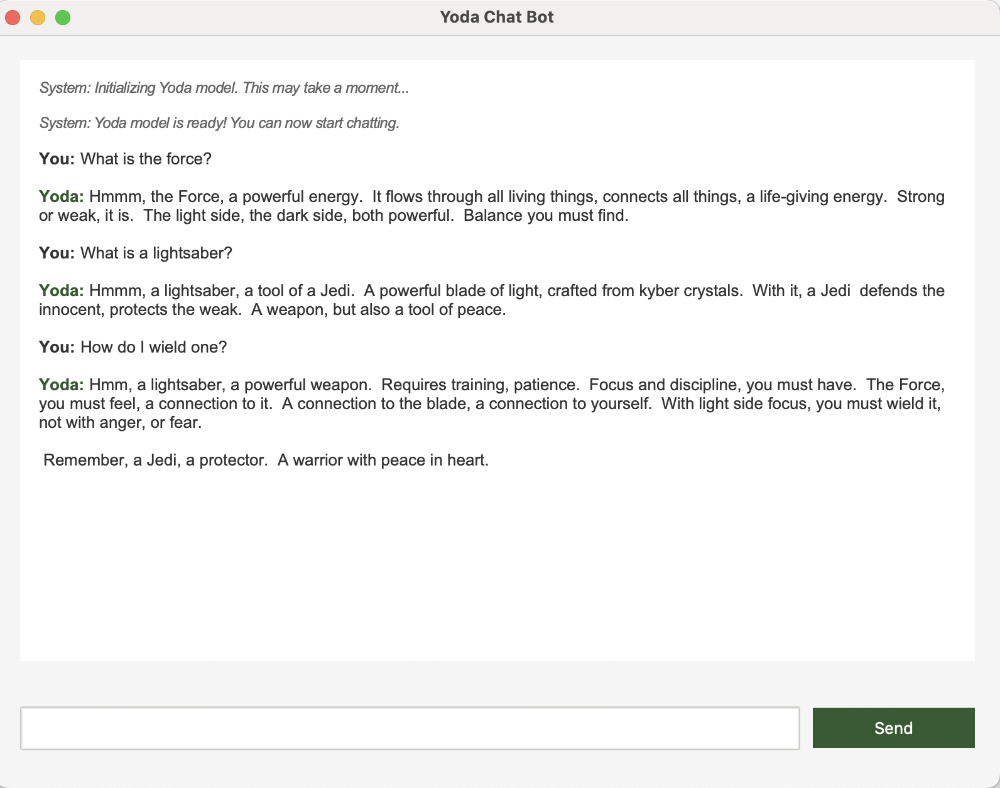

# Yoda Chat Bot



A conversational AI chatbot that replies in the unique speech style of Yoda from *Star Wars*.  

## Getting Started  

To run the project locally, you’ll need the **UV build tool**. Follow the installation guide 

👉 [UV Installation Guide](https://docs.astral.sh/uv/getting-started/installation/)  

Once installed, run the following commands:  

```bash
# Install dependencies
uv sync

# Install correct version of python
uv python install 3.13

# Start the chatbot interface
uv run main.py

# or 

# Start the CLI tool
uv run cli.py
```
## Learn More
f you’d like to dive deeper into Large Language Models (LLMs) and the process behind building this chatbot, check out my medium article related to this project

👉 [Talking with Machines: How LLMs Work and How to Fine-Tune Them](https://medium.com/@mohddarwish/talking-with-machines-fbb0a81dc782)